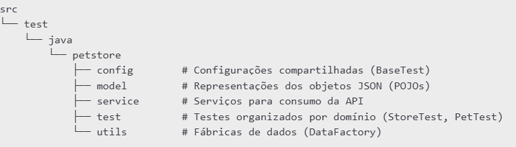

# 🧪 Testes Automatizados - API PetStore (Swagger)

Este projeto é uma suíte de testes automatizados utilizando **Java**, **RestAssured** e **JUnit 5** para validar endpoints da API pública da [Swagger PetStore](https://petstore.swagger.io/).

---

## 🔧 Tecnologias Utilizadas

- Java 17+
- Gradle 8+
- JUnit 5
- RestAssured
- Hamcrest
- IntelliJ IDEA (recomendado)
- Jackson (serialização JSON)

---

## 📂 Estrutura do Projeto




---

## ✅ Pré-requisitos

- Java 17 ou superior
- Gradle 8.10+
- Git instalado (opcional)

---

## 🚀 Como rodar o projeto pela primeira vez

### 1. Clone o repositório:

```bash
git clone https://github.com/seu-usuario/seu-repo.git
cd seu-repo 
```

### 2. Baixe as dependências e compile o projeto:
```
./gradlew build --refresh-dependencies
```
💡 Em Windows, use gradlew.bat no lugar de ./gradlew

### 3. Execute todos os testes:
```
./gradlew test
```

### 4. (Opcional) Execute uma classe de teste específica:
```
./gradlew test --tests "petstore.test.StoreTest"
./gradlew test --tests "petstore.test.PetTest"
```

## ✅ Casos de Teste Implementados
**🔹 StoreTest**

1.Cadastro de pedido com sucesso (POST /store/order)

**🔹 PetTest**

2.Buscar pet inexistente (GET /pet/{petId})

3.Atualizar pet com sucesso (PUT /pet)

4.Buscar pets por status "pending" (GET /pet/findByStatus)


### 👩‍💻 Autor(a)

- **Nome:** Roberta Lacerda Silva de Jesus
- **Contato:** (31)975648826
- **LinkedIn:** [Perfil LinkedIn](https://www.linkedin.com/in/roberta-lacerda/)


